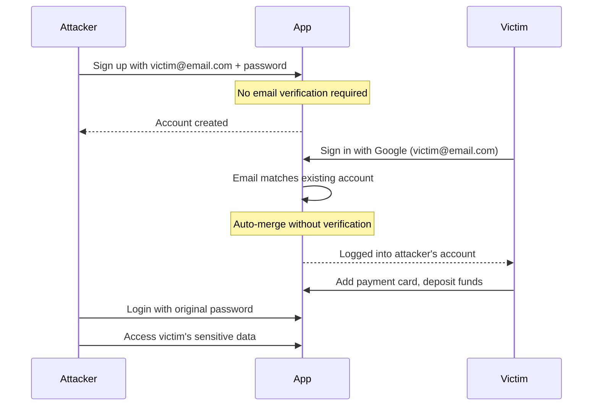

## 🔐 Pre-Account Takeover CTF Lab

<div align="center">


**An interactive Capture The Flag lab for learning and practicing pre-account takeover vulnerabilities**

[🎯 Try the Lab](#-quick-start) • [📖 Documentation](#-vulnerability-overview) • [🏆 Challenge](#-the-challenge) • [💡 Learning Objectives](#-learning-objectives)

</div>

---

## 🎯 Quick Start
```bash
# Clone the repository
git clone https://github.com/theemperorspath/pre-account-takeover.git

# Navigate to the lab
cd pre-account-takeover

# Open the lab (or deploy to your preferred environment)
python3 -m http.server 8000

Then open http://loclahost:8000/index.html in your browser
```

**Target Application:** SecureBank - A vulnerable banking application  
**Victim Email:** `alice.smith@company.com`  
**Your Goal:** Capture the f by exploiting the pre-account takeover vulnerability

---

## 🔍 Vulnerability Overview

### What is Pre-Account Takeover?

Pre-account takeover is a critical authentication vulnerability that occurs when applications support multiple authentication methods (email/password + OAuth) but fail to properly verify account ownership during the merge process.

### The Attack Vector


### Vulnerability Conditions

This vulnerability exists when **ALL** of the following conditions are met:

- ✅ Application supports both email/password AND OAuth authentication
- ✅ Email address is used as the primary account identifier
- ✅ Email/password registration doesn't require email verification
- ✅ OAuth login auto-merges with existing accounts
- ✅ No ownership verification during account merge

---

## 🎮 The Challenge

### Scenario

You've discovered that **SecureBank** has a critical authentication flaw. Alice Smith, a high-value customer, is about to create her account using "Sign in with Google". Your mission is to exploit the pre-account takeover vulnerability and capture the flag.

### Exploitation Steps

#### Phase 1: Pre-Account Creation (Attacker)
```
1. Navigate to SecureBank's "Create Account" section
2. Register using: alice.smith@company.com
3. Set a password you control (e.g., "AttackerPass123")
4. Notice: No email verification required ⚠️
```

#### Phase 2: OAuth Login (Victim Simulation)
```
5. Click "Sign in with Google" button
6. When prompted, enter: alice.smith@company.com
7. Observe: Automatically logged into existing account
8. No warning or confirmation prompt shown ⚠️
```

#### Phase 3: Data Collection (Victim Activity)
```
9. As the victim, add payment information
10. Deposit funds into the account
11. Watch the exploit tracker update in real-time
```

#### Phase 4: Account Takeover (Attacker)
```
12. Logout from the victim session
13. Login with: alice.smith@company.com / AttackerPass123
14. Access victim's payment methods and balance
15. Click "Capture Flag" to complete the challenge 🚩
```

### Success Criteria

- ✅ Pre-account created with victim's email
- ✅ Victim logged in via OAuth into compromised account
- ✅ Victim's sensitive data captured
- ✅ Flag retrieved: `CTF{REDACTED}`

---

## 💡 Learning Objectives

By completing this CTF lab, you will understand:

1. **Authentication Flow Weaknesses**
   - How multi-authentication systems can be exploited
   - The critical importance of email verification
   - OAuth security assumptions and their limitations

2. **Account Merge Vulnerabilities**
   - Why automatic account merging is dangerous
   - Proper account ownership verification techniques
   - User experience vs. security trade-offs

3. **Real-World Impact**
   - Financial fraud potential
   - Privacy violations and data breaches
   - Regulatory compliance implications (GDPR, CCPA)

4. **Defensive Techniques**
   - Implementing email verification workflows
   - Secure account merge confirmations
   - Multi-factor authentication strategies

---

## 🛡️ Mitigation Strategies

### Recommended Fixes

#### 1. **Require Email Verification**
```javascript
// Before allowing account usage
if (!user.emailVerified) {
  return sendVerificationEmail(user.email);
}
```

#### 2. **Account Merge Confirmation**
```javascript
// When OAuth email matches existing account
if (existingAccount && !existingAccount.oauthLinked) {
  return promptAccountMerge({
    message: "An account with this email already exists.",
    options: ["Merge Accounts", "Use Different Email"],
    verification: "password_required"
  });
}
```

#### 3. **Ownership Verification**
```javascript
// Verify the user owns the email before merging
async function mergeAccounts(oauthEmail, existingAccount) {
  // Send verification code to email
  const code = await sendVerificationCode(oauthEmail);
  
  // Require user to enter code
  const userCode = await promptUserForCode();
  
  if (code === userCode) {
    return linkOAuthToAccount(existingAccount);
  }
  
  throw new Error("Verification failed");
}
```

#### 4. **Session Invalidation**
```javascript
// Invalidate all existing sessions when OAuth is linked
function linkOAuthProvider(account, provider) {
  account.oauthProviders.push(provider);
  invalidateAllSessions(account);
  notifyUser("OAuth provider linked - please log in again");
}
```

---

## 📊 Vulnerability Stats

<div align="center">

| Metric | Value |
|--------|-------|
| **CVSS Score** | 8.1 (High) |
| **CWE** | CWE-287: Improper Authentication |
| **OWASP Top 10** | A07:2021 – Identification and Authentication Failures |
| **Real-world Prevalence** | ~15% of apps with OAuth |
| **Average Time to Exploit** | < 5 minutes |

</div>

---

## 🔬 Lab Features

### Interactive Elements
- ✅ Real-time exploit tracker
- ✅ Step-by-step vulnerability guidance
- ✅ Multiple OAuth providers (Google, GitHub)
- ✅ Simulated banking operations
- ✅ Visual feedback and hints
- ✅ Debug mode for learning

### Technical Implementation
- **Frontend:** React with Hooks
- **Styling:** Tailwind CSS
- **State Management:** In-memory (no backend required)
- **Icons:** Lucide React
- **Compatibility:** Modern browsers (Chrome, Firefox, Safari, Edge)

---

## 🎓 Additional Resources

### Reading Material
- [OWASP Authentication Cheat Sheet](https://cheatsheetseries.owasp.org/cheatsheets/Authentication_Cheat_Sheet.html)
- [OAuth 2.0 Security Best Practices](https://tools.ietf.org/html/draft-ietf-oauth-security-topics)
- [Account Takeover Prevention Guide](https://owasp.org/www-community/attacks/Account_Takeover)

### Related Vulnerabilities
- Account Enumeration
- Session Fixation
- OAuth Token Theft
- Email Verification Bypass
- Password Reset Poisoning

### Bug Bounty Programs
This vulnerability class is commonly found in bug bounty programs:
- **HackerOne:** Multiple reports with $500-$5,000 bounties
- **Bugcrowd:** Authentication bypass category
- **Synack:** High-priority finding

---

## ⚠️ Legal Disclaimer
```
┌─────────────────────────────────────────────────────────────┐
│  FOR EDUCATIONAL PURPOSES ONLY                              │
│                                                             │
│  This lab is designed for authorized security testing      │
│  and educational purposes. DO NOT use these techniques     │
│  on systems you do not own or have explicit permission     │
│  to test.                                                   │
│                                                             │
│  Unauthorized access to computer systems is illegal and    │
│  punishable under laws such as:                            │
│  • Computer Fraud and Abuse Act (CFAA) - USA              │
│  • Computer Misuse Act - UK                                │
│  • Cybercrime laws in your jurisdiction                   │
│                                                             │
│  Always practice responsible disclosure and obtain         │
│  written authorization before testing.                     │
└─────────────────────────────────────────────────────────────┘
```

---

## 🤝 Contributing

We welcome contributions to improve this CTF lab!

### How to Contribute

1. Fork the repository
2. Create a feature branch (`git checkout -b feature/AmazingFeature`)
3. Commit your changes (`git commit -m 'Add some AmazingFeature'`)
4. Push to the branch (`git push origin feature/AmazingFeature`)
5. Open a Pull Request

### Contribution Ideas
- Additional vulnerability scenarios
- Improved UI/UX
- Additional mitigation examples
- Translations
- Documentation improvements
- Bug fixes

---

## 📜 License
```
MIT License

Copyright (c) 2025 0days Security Labs

Permission is hereby granted, free of charge, to any person obtaining a copy
of this software and associated documentation files (the "Software"), to deal
in the Software without restriction, including without limitation the rights
to use, copy, modify, merge, publish, distribute, sublicense, and/or sell
copies of the Software, and to permit persons to whom the Software is
furnished to do so, subject to the following conditions:

The above copyright notice and this permission notice shall be included in all
copies or substantial portions of the Software.

THE SOFTWARE IS PROVIDED "AS IS", WITHOUT WARRANTY OF ANY KIND, EXPRESS OR
IMPLIED, INCLUDING BUT NOT LIMITED TO THE WARRANTIES OF MERCHANTABILITY,
FITNESS FOR A PARTICULAR PURPOSE AND NONINFRINGEMENT. IN NO EVENT SHALL THE
AUTHORS OR COPYRIGHT HOLDERS BE LIABLE FOR ANY CLAIM, DAMAGES OR OTHER
LIABILITY, WHETHER IN AN ACTION OF CONTRACT, TORT OR OTHERWISE, ARISING FROM,
OUT OF OR IN CONNECTION WITH THE SOFTWARE OR THE USE OR OTHER DEALINGS IN THE
SOFTWARE.
```

---

## 🌟 Acknowledgments

- **OWASP** - For authentication security guidelines
- **PortSwigger** - For web security research and education
- **HackerOne** - For real-world vulnerability disclosure data
- **Bug Bounty Community** - For discovering and reporting these vulnerabilities

---

## Contact

<div align="center">

[](https://twitter.com/0daysLabs)
[](https://discord.gg/0days)
[](mailto:labs@0days.security)

**Found a bug in the lab?** [Open an issue](https://github.com/theemperorspath/pre-account-takeover/issues)  
**Have questions?** [Start a discussion](https://github.com/theemperorspath/pre-account-takeover/discussions)

</div>

---

<div align="center">

### 🎯 Happy Hacking! 🎯

**Remember: With great power comes great responsibility.**

Made with ❤️ by 0days_cyber


</div>
